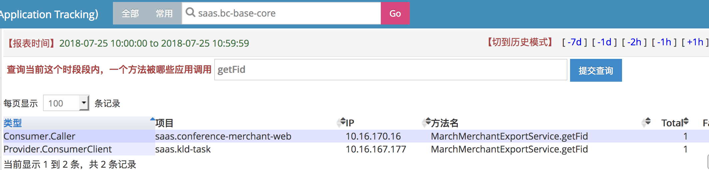

Cat-Cross报表问题回顾

# 起因




***此处打点都是provider数据，以Consumer开头的类型指dubbo-consumer发出请求前打点数据经过反转处理后录入dubbo-provider端数据以作统计，以Provider开头的类型指dubbo-provider接收到请求后的打点数据。***

正常情况下,对同一个方法的调用，项目名和IP应该保持一致，并Total保持一致，在网络异常时，可能导致provider端的total数据小于consumer端的数据。

*上图可以看到，在*MarchMerchantExportService.getFid这个方法的调用打点中，在dubbo-consumer端的打点记录为 项目名`saas.conference-merchant-web` IP为`10.16.170.16`，而在dubbo-provider端的打点记录为 项目名`saas.kld-task` IP为`10.16.167.177`，这是完全不合理及错误的。

经过观察，`Consumer.Caller`打点中的IP``10.16.170.16``为`saas.conference-merchant-web`的其中一个，**但**在`Provider.ConsumerClient`打点中的IP``10.16.167.177``实为dubbo-provider `saas.bc-base-core`的IP。


# 已知问题

- Provider端打点的项目名错误(业务方表示没有调用此方法却有打点数据)
- Provider端打点的IP错误


#排查过程

## 关于Dubbo打点

***以下流程在Dubbo中CatTransactionFilter中***

###Dubbo-Consumer打点

```sequence
Note left of DubboConsumer: 1、从DUBBO-Invoker-URL中获取application
Note left of DubboConsumer: 1、注入到attachment的dubboProxyConsumerApplicationName
Note left of DubboConsumer:2、!!从DUBBO-Invoker-URL中获取host
Note left of DubboConsumer:2、注入到attachment的dubboProxyConsumerHostIp
DubboConsumer->CatServer:3、打点ConsumerCall.ProviderApp的CatEvent
Note right of CatServer:3、从RpcContext中获取ProviderApplicationName
DubboConsumer->CatServer:4、打点ConsumerCall.ProviderIp的CatEvent
Note right of CatServer:4、从DUBBO-Invoker-URL中获取host

```


***dubboProxyConsumerHostIp：此字段标识dubbo-consumer的hostIp***

***以上第2步中，从URL中获取host注入到dubboProxyConsumerHostIp,这是一个错误的数据，URL中的host是dubbo-provider的hostIP***


###Dubbo-Provider打点

```sequence
DubboProvider->CatServer:1、打点ProviderService.ConsumerApp的CatEvent
Note right of CatServer:1、从Attachment中读取dubboProxyConsumerApplicationName
DubboProvider->CatServer:2、打点ProviderService.ConsumerIp的CatEvent
Note right of CatServer:2、从Attachment中读取attachment的dubboProxyConsumerHostIp
```

***dubbo-provider端的打点，数据都是从Attachment中读取，而Attachment中的数据是由dubbo-consumer端注入的，上述数据在dubbo-consumer端注入错误，导致dubbo-provider端打点数据也是错误的***


### 结论

***上述在dubbo-consumer中注入consumerHostIp错误，导致截图中IP错误***


## 关于Cat-Cross报表

### 数据处理

```flow
st=>start: Start
condRpc=>condition: isClient?
opCli1=>operation: 注入RemoteAddress为ConsumerCall.ProviderIp
opCli2=>operation: 注入App为ConsumerCall.ProviderApp
opCli3=>operation: 注入LocalAddress为tree.Ip
opSer1=>operation: 注入RemoteAddress为ProviderService.ConsumerIp
opSer2=>operation: 注入App为ProviderService.ConsumerApp
opSer3=>operation: 注入LocalAddress为tree.Ip
opAll=>operation: 获取CrossInfo
condRpc2=>condition: isClient?
opCli4=>operation: 反转CrossInfo
opRep1=>operation: 更新Provider端报表
e=>end

st->condRpc->opAll->e
condRpc(yes)->opCli1->opCli2->opCli3->opAll
condRpc(no)->opSer1->opSer2->opSer3->opAll
opAll->condRpc2
condRpc2(yes)->opCli4->opRep1
condRpc2(no)->opRep1
opRep1->e

```

***反转CrossInfo中，会把Consumer端的信息反转模拟成Provider端的打点数据做统计，Cat中的打点数据主要是以AppName分割，所以这里需要反转数据注入到Provider数据统计中去。***

### Cat-Cross报表结构

Cross报表层级分为多层

- Cross-Report : 根据tree.domain和当前时间区段生成文件名
  - Local : tree.domain下的单个hostIP
    - Remote : 远程请求数据统计 RemoteId=remoteIp + ":" + role;
      - Type : 与Remote 1:1
        - Name : 记录调用方法的的统计师数据


**例：**

```xml
<cross-report domain="{providerAppName}" startTime="2018-07-27 09:00:00" endTime="2018-07-27 09:59:59">
	<local id="{providerHostIp}">
         <remote id="{ConsumerHostIp}:{ConsumerAppName}:{RoleType}" role="Consumer.Caller" app="{ConsumerAppName}" ip="{ConsumerHostIp}">
              <type id="ConsumerCall" totalCount="8" failCount="0" failPercent="0.00" avg="0.00" sum="602.68" tps="0.00">
                   <name id="RedPackageService.checkSendRedPackage" totalCount="7" failCount="0" failPercent="0.00" avg="0.00" sum="129.30" tps="0.00"/>
                  <name id="RedPackageService.sendRedPackage" totalCount="1" failCount="0" failPercent="0.00" avg="0.00" sum="473.38" tps="0.00"/>
             </type>
        </remote>
    </local>
</cross-report>
```


***在创建Remote时，使用` {remoteIp}:{role}`来标识，而remoteIp应该在dubboProvider端应该表示为dubbo-consumer的hostIp,由于在上述中dubbo-consumer打点中consumerHostIP注入错误，导致dubbo-provider收到的所有请求的consumerHostIp都是providerIp，而`Remote`的的`app`字段只在第一次生成时注入，所以导致之后会有完全没调用过的方法统计进第一个调用的consumer名下。***

### 结论

***Remote标识中未区分consumer的Appname导致数据被错误合并，在修复中更新为`{remoteIp}:{remoteAppName}:{role}`*** 


# 排查过程中的其他问题

- 在`dubboConsumer`端打点记录`consumerAppName`使用的是`consumer`的`DubboApplicationName`，而`Cat-MessageTree`中的`Domain`使用的是`app.properties`中的`app.id`，在Cat处理数据中，`consumer`打点数据由于反转导致标识`consumerAppName`为`app.properties`中的`app.id`,而`provider`打点数据中的`consumerAppName`由于是`consumer`注入的，所以是`consumer`的`DubboApplicationName`，如果`consumer`的`DubboApplicationName`和`app.properties`中的`app.id`不一致，导致cross页面数据中项目名不一致。

  

# 处理结果

1. 修改`Dubbo`中在`Consumer`打点中`AppName`获取来源为 `Cat.getManager().getDomain()`
2. 修改`Dubbo`中在`Consumer`打点中`HostIp`获取来源为`LocalHostIP`
3. 修改`Dubbo`中在`Provider`打点中`ConsumerHostIp`获取来源为`RpcContext.getContext().getRemoteHost()`
4. 修改`Cat-Cross`报表中的`RemoteId`为`{remoteIp}:{remoteAppName}:{role}`


***第1和2点需要dubbo-consumer端更新dubbo版本***

***第3点需要dubbo-provider端更新dubbo版本***

***第4点需要Cat更新Server端，已于20180726上线***

***dubbo修复版:2.8.0-SNAPSHOT***